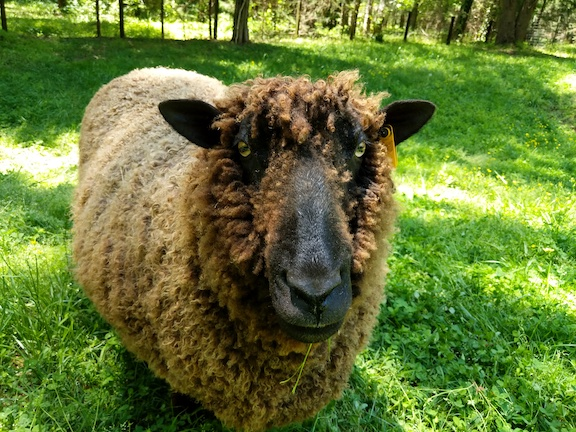

```{r setup, include=FALSE}
knitr::opts_chunk$set(echo = TRUE)
library(knitr)
```

# R Markdown Basics

## R Markdown

This is an R Markdown document. Markdown is a simple formatting syntax for authoring HTML, PDF, and MS Word documents. For more details on using R Markdown see <http://rmarkdown.rstudio.com>.

When you click the **Knit** button a document will be generated that includes both content as well as the output of any embedded R code chunks within the document. You can embed an R code chunk like this:

```{r cars}
summary(cars)
```

## Insert pre-existing content

Including pre-existing images and text is especially convenient for generating reports.  The markdown itself is just an assemby tool for putting tegether results that were generated in upstream modules.  The upstream modules focus on individual results; while this report weaves them together into a comprehensive story.

### image

The `include_graphics()` method is very handy for including images.  For example:

```{r out.width="80%"}

```

### text

Here is an example referencing a text file:

``r readLines("photoCredit.txt")``

### html image syntax

When rendering the output to html, you can use standard html to insert images as part of your document.


\newpage
## Rmarkdown and BioLockJ

BioLockJ includes a module called `Rmarkdown`.  You can add it to the module run order with this line:

`#BioModule biolockj.module.diy.Rmarkdown`

Use relative paths in the Rmd file to reference pipeline files.  For example:
```{r}
workingDir <- getwd()
moduleDir <- dirname(workingDir)
pipeRoot <- dirname(moduleDir)
```

For ALL BioLockJ modules, the working directory is a subfolder of the module directory, and all modules in a pipeline have a folder immediately under the pipeline root directory. So the three lines in the above chunk are always the same anytime R is used in a BioLockJ pipeline.

In this case, the "working directory" is the ``r basename(workingDir)`` sub-directory of module folder for module: ``r basename(moduleDir)`` .

The module is in a pipeline located here:                     
``r pipeRoot``

To reference other modules in this pipeline, use the pipeline path and the modules name.  Do not reference the module number, that part of the name may change in different iteratioons of the pipeline.  But the module name is consistent.  For example:
```{r}
genModModule <- dir(pipeRoot, full.names=TRUE, pattern="GenMod")
genModOutFile <- file.path(genModModule, "output", "time.txt")
```

This relative reference style assumes that this is running in the context of a BioLockJ pipeline, and that the pipeline includes a module "01_GenMod" that includes and output file called `time.txt`.  The markdown report for a given pipeline is tailored to the pipeline.

```{r}
# The relative paths assume that this is running in the context of a BioLockJ pipeline
# In case this is run as a test outside of that context, use a stand-in message instead of all-out failure.
if(length(genModModule) == 1){
    if (file.exists(genModOutFile)){
        text <- readLines(genModOutFile)
    }else{
        text <- paste("Sorry, I don't see a file at this path:", genModOutFile)
    }
}else{
    text <- paste("Sorry, I don't see a GenMod module in the current pipeline.")
}
```

The `time.txt` file says:                  
``r text``

This report was generated at: ``r date()`` .

\newpage
It's a good practice to end scripts with reports with a call to `sessionInfo()` :

```{r}
sessionInfo()
```
